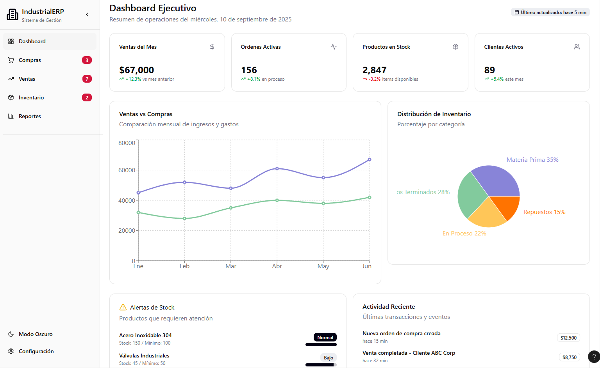
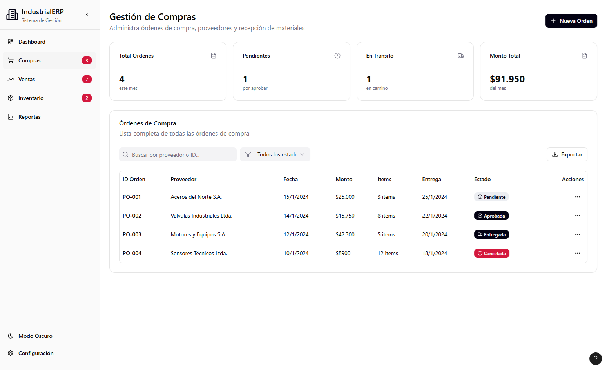
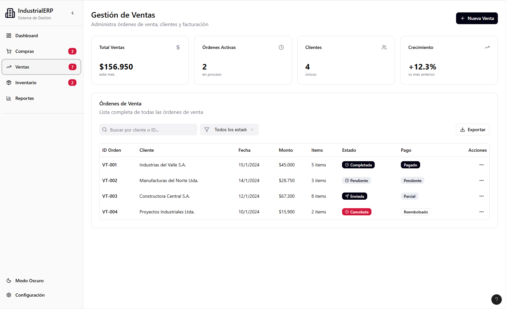
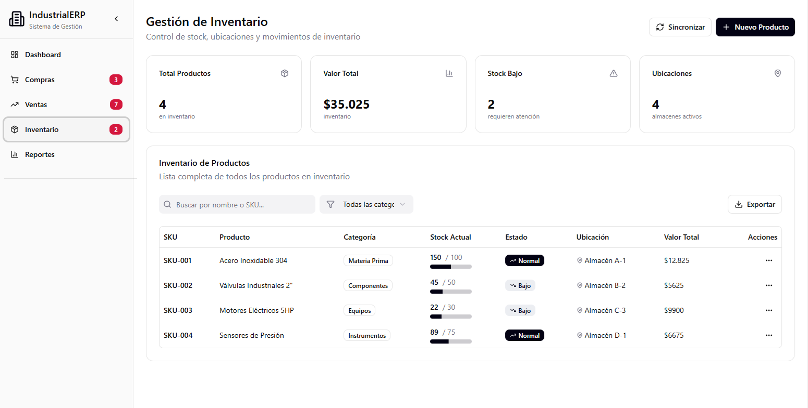

# Sistema de Gestión IndustrialERP

Este proyecto es un sistema integral de gestión para compras, ventas e inventario en entornos industriales, diseñado para optimizar operaciones, mejorar la visibilidad de datos y facilitar la toma de decisiones.

## Características Principales

- **Dashboard Ejecutivo**: Visualización clara de KPIs, ventas, órdenes activas, productos en stock y clientes activos.
- **Gestión de Compras**: Administración de órdenes de compra, proveedores y recepción de materiales.
- **Gestión de Ventas**: Control de órdenes de venta, clientes y facturación.
- **Gestión de Inventario**: Control de stock, ubicaciones, movimientos y alertas.
- **Reportes**: Acceso rápido a informes clave para la operación.
- **Modo Oscuro**: Experiencia amigable para distintos ambientes de trabajo.

## Capturas de Pantalla

### 1. Dashboard Ejecutivo

Resumen de operaciones diarias, con indicadores clave y gráficos de ventas vs compras, distribución de inventario, alertas de stock y actividad reciente.



---

### 2. Gestión de Compras

Visualiza y administra órdenes de compra con estados, proveedores, fechas y montos.



---

### 3. Gestión de Ventas

Gestión de pedidos, clientes y seguimiento del estado de las ventas y pagos.



---

### 4. Gestión de Inventario

Control detallado de productos, categorías, stock actual y ubicaciones.



---

## Instalación

1. Clona el repositorio:
   ```bash
   git clone https://github.com/lagarlabs/gestion-de-compras-y-ventas.git
   ```
2. Instala dependencias:
   ```bash
   npm install
   ```
3. Configura tu base de datos y variables de entorno según el archivo `.env.example`.
4. Inicia la aplicación:
   ```bash
   npm start
   ```

## Uso

- Accede al dashboard para consultar métricas y alertas.
- Navega por las secciones de compras, ventas e inventario para gestionar órdenes y productos.
- Exporta reportes y consulta el historial de actividad.

## Tecnologías Utilizadas

- **Frontend**: React, TailwindCSS
- **Backend**: Node.js, Express
- **Base de datos**: (agregar según proyecto, ej. PostgreSQL, MySQL)
- **Otros**: (agregar integraciones o tecnologías extra)

## Contribución

¡Las contribuciones son bienvenidas! Por favor abre un Issue o Pull Request para sugerencias, errores o nuevas funcionalidades.

## Licencia

Este proyecto está bajo la licencia MIT.

---

**Desarrollado por [Lagarlabs](https://github.com/lagarlabs)**
